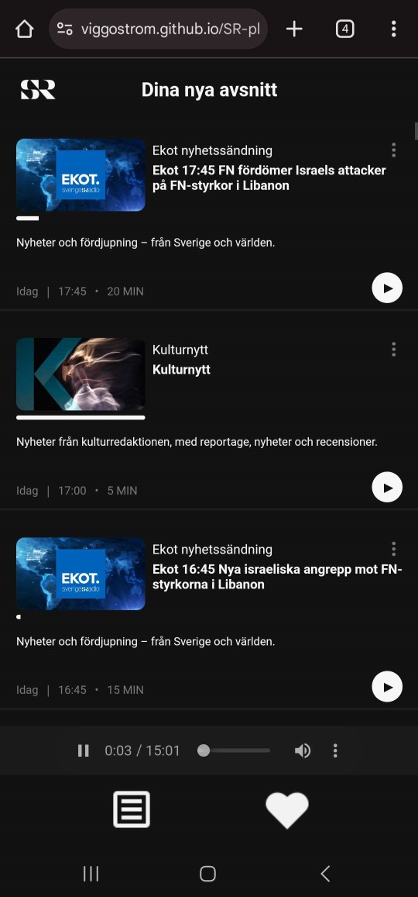
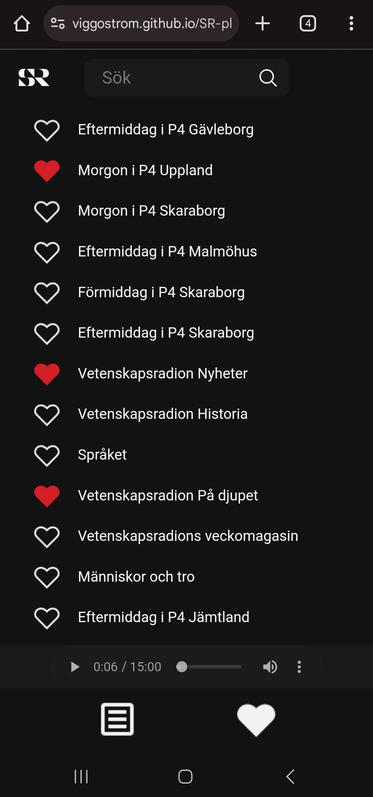

# SR Play - But for Me

Deployed via [GitHub Pages](https://viggostrom.github.io/SR-play-for-me/)

## Reasoning
I was growing tired of the [SR Play app](https://play.google.com/store/apps/details?id=se.sr.android&pcampaignid=web_share) on android since it had a bunch of bugs that really bugged me, so I decided to make my own version. The Swedish national radio has a completely [open API](https://api.sr.se/api/documentation/v2/index.html) which allowed me to make this app.

## Usage
On the index page you need to favorite some programs by clicking the heart icon on it. Then you can go to the favorites page and listen to your favorite programs. There you'll see the latest episodes of your favorite programs. The episodes automatically play one after another. 

## Technologies
- HTML
- CSS
- JavaScript
- API

